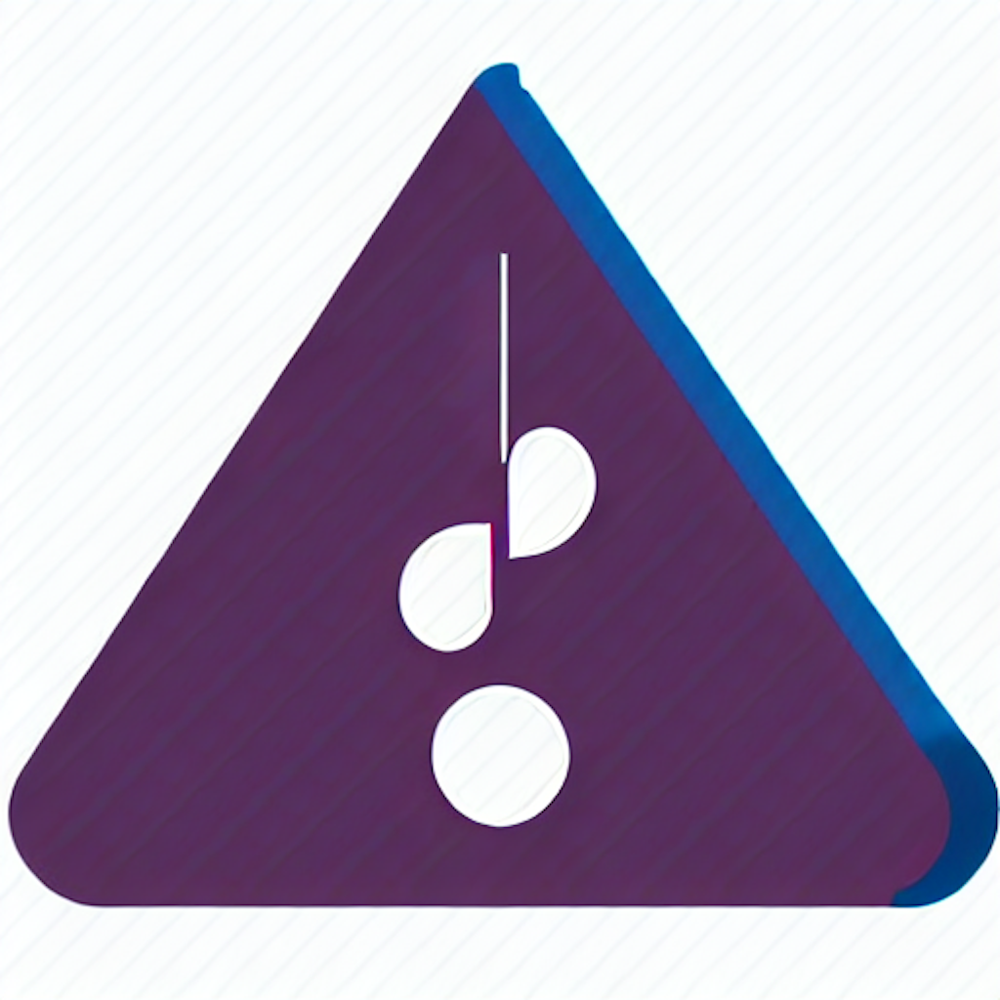

#  Intervals

## "Intervals zone: The Ultimate Musical Training Game!

Combine fun and education with Intervals! 
This unique app challenges you to identify the intervals between two notes played, measured in semitones. 
Whether you're an aspiring musician, a music student, or simply looking to improve your musical skills, Intervals is the perfect tool for you. 
With its interactive gameplay and engaging design, you'll find yourself absorbed in this musical journey in no time.

Features:

- Turn musical education into a game with increasing difficulty levels.
- Wide range of intervals to identify, from minor second to octave.
- Real-time feedback and score tracking to monitor your progress.
- A visually stunning interface that is easy to use.

Get ready for a musical adventure with Intervals zone! 

Download now and discover the fun way to master musical intervals!"

## Links

[_Get on the AppStore_](https://apps.apple.com/in/app/intervals-zone/id1669574204)

[_Go to repo_](https://github.com/ionutsava674/intervals)

